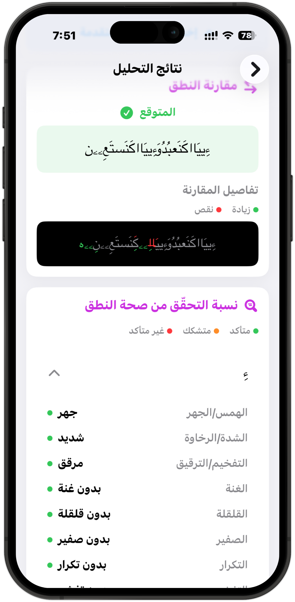
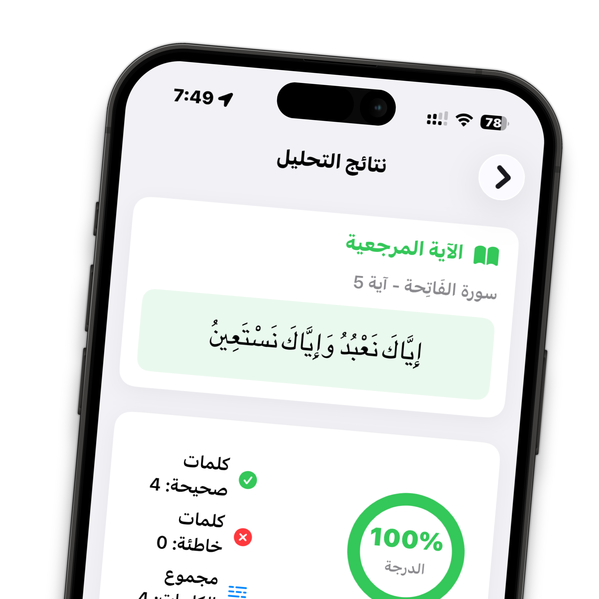
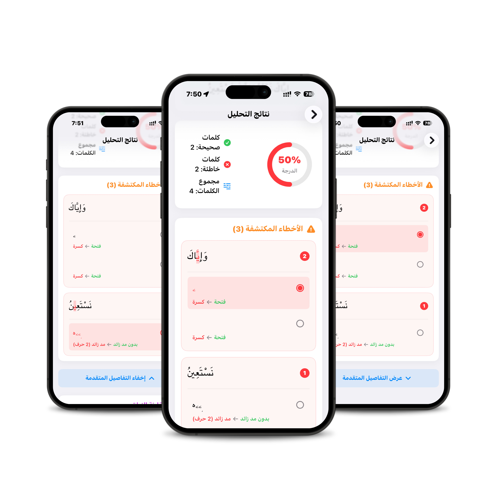

# Quran Muaalem - iOS App & API Deployment

<div align="center">

**A production-ready deployment of the Quran Muaalem AI model with a beautiful iOS interface**

[](https://github.com/obadx/quran-muaalem)
[](LICENSE)
[](https://modal.com)
[](https://swift.org)

</div>

---

## About This Project

This project is a **test and demonstration** of deploying the [Quran Muaalem](https://github.com/obadx/quran-muaalem) AI model in production, paired with a native iOS application that provides an intuitive, user-friendly interface for Quranic recitation analysis.

**Built upon the groundbreaking work of [obadx/quran-muaalem](https://github.com/obadx/quran-muaalem)** - an AI teacher for the Holy Quran capable of detecting recitation errors, Tajweed rules, and phonetic features.

### What This Project Provides

1. **Python API (FastAPI + Modal)**: A production-ready HTTP API wrapper around the Quran Muaalem model, deployed on Modal with GPU support for fast inference.

2. **Swift iOS App**: A native iOS application with a beautiful Arabic UI that transforms complex API responses into clear, educational feedback that users can understand and learn from.

---

## Screenshots

<div align="center">

### iOS App Interface

<table>
  <tr>
    <td align="center">
      
      <br />
      <sub><b>Recording Screen</b></sub>
      <br />
      <sub>Select Sura & Aya with verse preview</sub>
    </td>
    <td align="center">
      
      <br />
      <sub><b>Results Screen</b></sub>
      <br />
      <sub>Word-based scoring with error cards</sub>
    </td>
    <td align="center">
      
      <br />
      <sub><b>Interactive Errors</b></sub>
      <br />
      <sub>Tap errors to highlight letters</sub>
    </td>
  </tr>
</table>

</div>

---

## Features

### 🚀 Python API Features

- **FastAPI Wrapper**: RESTful API around the Quran Muaalem model
- **Modal Deployment**: Serverless GPU deployment with automatic scaling
- **Two Analysis Modes**:
  - Analyze by verse reference (Sura & Aya)
  - Analyze by custom Uthmani text
- **Advanced Error Detection**:
  - Phoneme-level comparison
  - Sifat (phonetic features) analysis
  - Word-by-word phoneme mapping
  - Madd (elongation) error detection
  - Harakat (vowel mark) error detection
- **Configurable Tajweed Rules**: Support for different Madd lengths and recitation styles (Rewaya)
- **Cost-Effective**: Only pay for GPU time during inference (~$0.59/hour for T4 GPU, billed per second)

### 📱 iOS App Features

- **Intuitive Arabic UI**: Beautiful, modern interface designed for Arabic speakers
- **Easy Recording**: One-tap audio recording with visual feedback
- **Verse Selection**: Browse and select any Sura and Aya with live verse preview
- **Smart Analysis Display**:
  - **Word-Based Scoring**: Clear percentage score based on correct vs. incorrect words
  - **Error Grouping**: Errors grouped by word for easy understanding
  - **Interactive Highlighting**: Tap any error to highlight the problematic letter in the word
  - **Simplified Error Messages**: Technical terms translated to user-friendly Arabic
- **Advanced Details**: Optional technical view for advanced users showing:
  - Phoneme comparison
  - Detailed Sifat analysis
  - Raw API response data
- **Customizable Settings**: Configure Madd rules and recitation style (Rewaya)
- **Smart Font Rendering**: Uses KFGQPC Hafs Smart Regular font for accurate Quranic text display
- **Offline Verse Data**: Includes complete Quran text (hafs_smart_v8.json) for offline verse preview

---

## Architecture

```
┌─────────────────┐
│   iOS App       │
│  (Swift/SwiftUI)│
│                 │
│  - Recording    │
│  - UI/UX        │
│  - Error Display│
└────────┬────────┘
         │
         │ HTTPS
         │
         ▼
┌─────────────────┐
│  FastAPI Server │
│   (Modal.com)   │
│                 │
│  - GPU Inference│
│  - Phonetization│
│  - Error Compare│
└────────┬────────┘
         │
         │
         ▼
┌─────────────────┐
│ Quran Muaalem   │
│     Model       │
│  (660M params)  │
│                 │
│ obadx/muaalem-  │
│  model-v3_2     │
└─────────────────┘
```

**Flow**:
1. User records recitation in iOS app
2. App sends audio + verse reference to API
3. API loads audio, phonetizes the reference text, and runs inference
4. Model analyzes phonemes and phonetic features (Sifat)
5. API compares actual vs. expected, maps errors to words
6. iOS app receives structured response and displays user-friendly feedback

---

## Setup Instructions

### Prerequisites

- **For API**: Python 3.11+, Modal account (free tier available)
- **For iOS App**: macOS with Xcode 15+, iOS 17+ device or simulator

### 🐍 Python API Setup (Modal Deployment)

#### 1. Install Modal CLI

```bash
pip install modal
```

#### 2. Authenticate with Modal

```bash
modal setup
```

This will open your browser for authentication.

#### 3. Deploy the API

```bash
cd main
modal deploy modal_app.py
```

After deployment, Modal will provide you with a URL like:
```
https://your-username--quran-muaalem-api-muaalemapi-serve.modal.run
```

#### 4. Test the Deployment

```bash
curl https://your-username--quran-muaalem-api-muaalemapi-serve.modal.run/health
```

**Cost Information**:
- Modal offers $30/month free credits
- T4 GPU costs ~$0.59/hour (billed per second)
- First request after idle: 30-60 seconds (cold start)
- Subsequent requests: 1-3 seconds

### 📱 iOS App Setup

#### 1. Open the Project

```bash
cd Quran-Muaalem-Swift
open Quran-Muaalem-Swift.xcodeproj
```

#### 2. Configure API Endpoint

Edit `Quran-Muaalem-Swift/Services/MuaalemAPI.swift` and update the `baseURL`:

```swift
private let baseURL = "https://your-username--quran-muaalem-api-muaalemapi-serve.modal.run"
```

#### 3. Build and Run

1. Select a target device (iPhone simulator or physical device)
2. Press `Cmd + R` to build and run
3. Grant microphone permissions when prompted

#### Requirements

- Xcode 15.0 or later
- iOS 17.0 or later
- Microphone access (for recording)

---

## Usage

### API Usage Example

**Analyze by Verse**:

```bash
curl -X POST "https://your-api-url.modal.run/api/analyze-by-verse" \
  -F "audio=@recording.wav" \
  -F "sura=1" \
  -F "aya=2" \
  -F "rewaya=hafs" \
  -F "madd_monfasel_len=2" \
  -F "madd_mottasel_len=4"
```

**Response Structure**:

```json
{
  "phonemes_text": "ءَلحَمدُلِللَااهِ...",
  "sifat": [...],
  "reference": {
    "sura": 1,
    "aya": 2,
    "uthmani_text": "ٱلْحَمْدُ لِلَّهِ...",
    "phonetic_script": {...}
  },
  "expected_sifat": [...],
  "phoneme_diff": [...],
  "sifat_errors": [...],
  "phonemes_by_word": [
    {
      "word_index": 0,
      "word": "ٱلْحَمْدُ",
      "phonemes": "ءَلحَمدُ",
      "sifat_start": 0,
      "sifat_end": 4
    }
  ]
}
```

### iOS App Usage

1. **Launch the app**
2. **Select a Sura and Aya** using the pickers
3. **Preview the verse** text below the pickers
4. **Tap the microphone button** to start recording
5. **Recite the verse** clearly
6. **Tap stop** when finished
7. **View results**:
   - Overall score (percentage of correct words)
   - List of errors grouped by word
   - Tap any error to highlight the problematic letter
8. **Tap "Advanced Details"** to see technical information
9. **Adjust settings** via the gear icon (Madd rules, Rewaya)

---

## Project Structure

```
.
├── main/                          # Python API (original quran-muaalem + Modal deployment)
│   ├── modal_app.py              # Modal deployment configuration
│   ├── pyproject.toml            # Python dependencies
│   ├── README.md                 # Original project README
│   └── src/quran_muaalem/        # Core model code
│
├── Quran-Muaalem-Swift/          # iOS Application
│   └── Quran-Muaalem-Swift/
│       ├── Models/
│       │   ├── APIModels.swift   # API request/response models
│       │   └── QuranData.swift   # Quran data structures
│       ├── Services/
│       │   ├── AudioRecorder.swift   # Audio recording logic
│       │   └── MuaalemAPI.swift      # API client
│       ├── Views/
│       │   ├── RecordingView.swift   # Main recording interface
│       │   ├── ResultsView.swift     # Results display with error cards
│       │   └── SettingsView.swift    # Madd rules configuration
│       ├── Data/
│       │   └── hafs_smart_v8.json    # Complete Quran text data
│       └── Fonts/
│           └── HafsSmart_08.ttf      # Quranic font
│
└── README.md                      # This file
```

### Key Files

- **`main/modal_app.py`**: FastAPI server with Modal deployment config, includes:
  - Model loading and inference
  - Audio processing (librosa)
  - Phonetic alignment algorithm
  - Error detection and comparison
  - Word-by-word phoneme mapping

- **`Quran-Muaalem-Swift/Views/ResultsView.swift`**: Results display logic (~1900 lines), includes:
  - Word-based scoring calculation
  - Error grouping by word
  - Interactive error highlighting
  - Advanced details section
  - Phoneme diff visualization

- **`Quran-Muaalem-Swift/Services/MuaalemAPI.swift`**: API client with multipart form upload

- **`Quran-Muaalem-Swift/Data/hafs_smart_v8.json`**: Complete Quran text (6236 verses)

---

## Credits & License

### Original Work

This project is built upon the **[Quran Muaalem](https://github.com/obadx/quran-muaalem)** project by [Abdullah (obadx)](https://github.com/obadx).

**Original Project**:
- Repository: https://github.com/obadx/quran-muaalem
- Model: https://huggingface.co/obadx/muaalem-model-v3_2
- Paper: https://arxiv.org/abs/2509.00094

**Key Technologies from Original Project**:
- Multi-level CTC architecture
- Quran phonetic script (quran-transcript)
- Wav2Vec2BERT-based model
- Sifat (phonetic features) detection

### This Project's Contributions

- Production-ready Modal deployment
- FastAPI wrapper with enhanced error detection
- Word-by-word phoneme mapping algorithm
- Native iOS application with intuitive UI
- User-friendly error presentation
- Interactive error highlighting
- Configurable Tajweed settings

### License

This project is licensed under the **MIT License** - see the [LICENSE](LICENSE) file for details.

The original Quran Muaalem project is also licensed under the MIT License.

---

## Contributing

Contributions are welcome! This project serves as a reference implementation for:

1. **Deploying ML models on Modal** with GPU support
2. **Building mobile apps** that consume ML APIs
3. **Transforming technical ML outputs** into user-friendly interfaces
4. **Handling Arabic text and Quranic fonts** in iOS

### Areas for Contribution

- Additional recitation styles (Rewaya) support
- UI/UX improvements in the iOS app
- Android app implementation
- Performance optimizations
- Additional error detection rules
- Internationalization (English UI option)

### How to Contribute

1. Fork the repository
2. Create a feature branch (`git checkout -b feature/amazing-feature`)
3. Commit your changes (`git commit -m 'Add amazing feature'`)
4. Push to the branch (`git push origin feature/amazing-feature`)
5. Open a Pull Request

---

## Acknowledgments

- **Allah (SWT)** for the opportunity to work on Quranic technology
- **[Abdullah (obadx)](https://github.com/obadx)** for the original Quran Muaalem model and research
- **Modal.com** for providing an excellent serverless GPU platform
- **The Quran Muaalem community** for testing and feedback

---

## Support

For issues related to:
- **The ML model**: Please refer to the [original Quran Muaalem repository](https://github.com/obadx/quran-muaalem)
- **API deployment or iOS app**: Open an issue in this repository

---

<div align="center">

**May this project help Muslims worldwide improve their Quran recitation** 🤲

</div>

